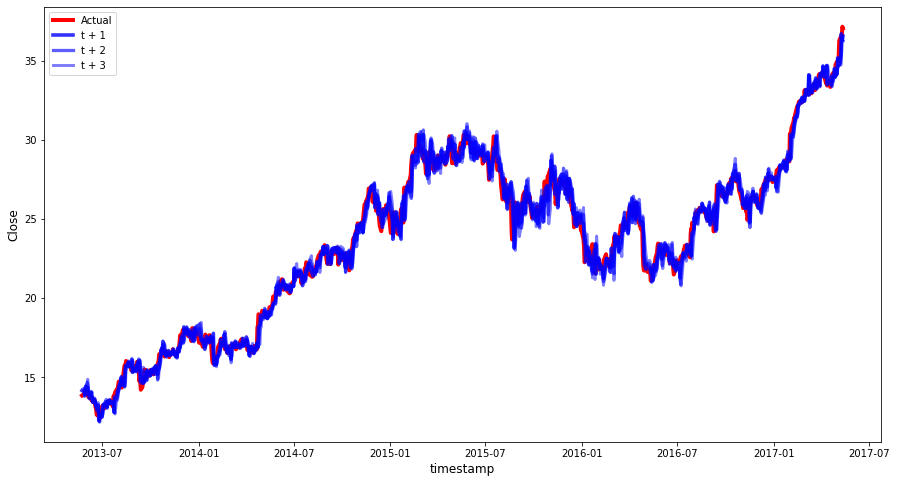

## Autoregressive integrated moving average

### Metrics

- ##### Predicting 1 units of time ahead

        R2 Score: - 0.989
        Mean Absolute Error - 0.405
        Mean Squared Error - 0.301
        Mean Absolute Percentage Error - 0.017

- ##### Predicting 2 units of time ahead

        R2 Score: - 0.983
        Mean Absolute Error - 0.516
        Mean Squared Error - 0.472
        Mean Absolute Percentage Error - 0.022

- ##### Predicting 3 units of time ahead
        R2 Score: - 0.977
        Mean Absolute Error - 0.605
        Mean Squared Error - 0.646
        Mean Absolute Percentage Error - 0.026

### Prediction chart

