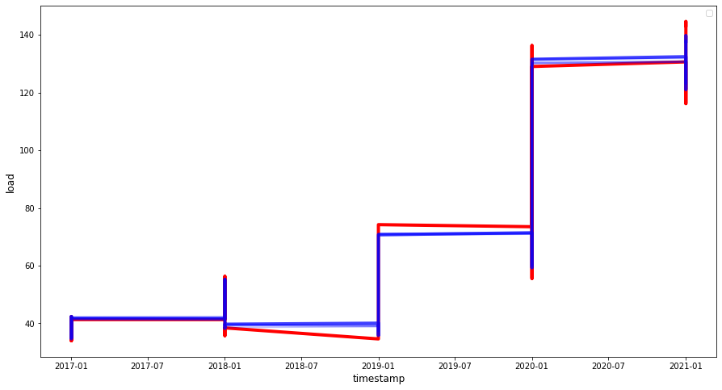

## Convolutional neural network

### Metrics

- ##### Predicting 1 units of time ahead

        R2 Score:                       -  0.991
        Mean Absolute Error             -  2.168
        Mean Squared Error              -  10.2
        Mean Absolute Percentage Error  -  0.03

- ##### Predicting 2 units of time ahead

        R2 Score:                       -  0.988
        Mean Absolute Error             -  2.49
        Mean Squared Error              -  13.043
        Mean Absolute Percentage Error  -  0.035

- ##### Predicting 3 units of time ahead
        R2 Score:                       -  0.986
        Mean Absolute Error             -  2.705
        Mean Squared Error              -  15.54
        Mean Absolute Percentage Error  -  0.038

### Prediction chart

