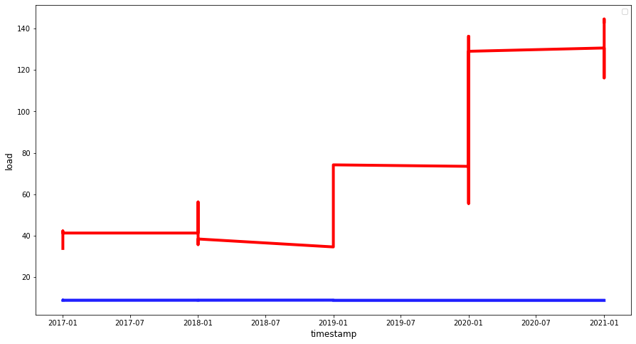

## Recurrent neural network

### Metrics

- ##### Predicting 1 units of time ahead

        R2 Score:                       -  -3.244
        Mean Absolute Error             -  59.98
        Mean Squared Error              -  4708.784
        Mean Absolute Percentage Error  -  0.845

- ##### Predicting 2 units of time ahead

        R2 Score:                       -  -3.197
        Mean Absolute Error             -  59.669
        Mean Squared Error              -  4675.472
        Mean Absolute Percentage Error  -  0.838

- ##### Predicting 3 units of time ahead
        R2 Score:                       -  -3.239
        Mean Absolute Error             -  60.184
        Mean Squared Error              -  4741.855
        Mean Absolute Percentage Error  -  0.846

### Prediction chart

