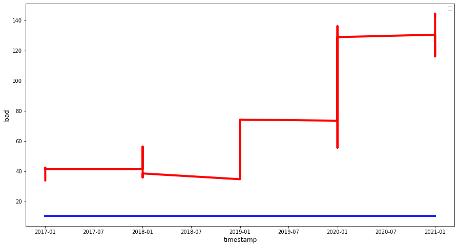

## Recurrent neural network

### Metrics

- ##### Predicting 1 units of time ahead

        R2 Score: - -3.076
        Mean Absolute Error - 58.423
        Mean Squared Error - 4522.834
        Mean Absolute Percentage Error - 0.818

- ##### Predicting 2 units of time ahead

        R2 Score: - -3.069
        Mean Absolute Error - 58.479
        Mean Squared Error - 4533.93
        Mean Absolute Percentage Error - 0.817

- ##### Predicting 3 units of time ahead
        R2 Score: - -3.068
        Mean Absolute Error - 58.586
        Mean Squared Error - 4550.944
        Mean Absolute Percentage Error - 0.818

### Prediction chart

